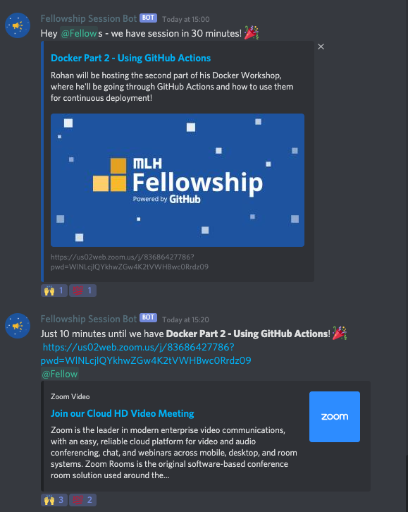

# Announcement Bot

Discord bot that announces upcoming sessions on upcoming MLH events!

Inspired by the [Hack Quarantine](https://hackquarantine.com) [Calendar Bot](https://github.com/HackQuarantine/calendar-bot) used to automatically make announcements from their calendar.




## Setup

Make sure to set your Google Calendar to the same timezone as the Discord Bot. In this case, it's the timezone of the Compute Engine on Google Cloud.

```
cp example.env .env
```

_Make sure to fill the `.env` file with the required fields and add the `credentials.json` file.

## Run

```bash
docker-compose build
docker-compose up -d
docker-compose logs -f
```

## Turn off

```
docker-compose down
```

## Add Calendar events

### Title

Event Name in Google Calendar

### Event URL

Set the Location field with the URL. This is where Zoom and Google Meet will automatically add their URLs.

### Event Description

